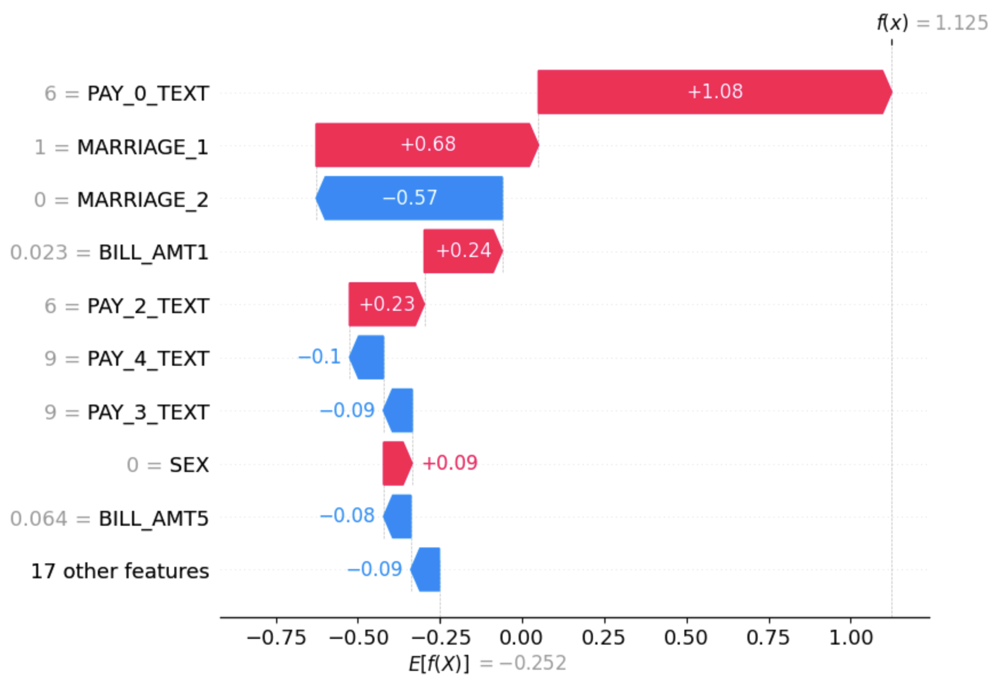

```{python}
import warnings
import numpy as np
import pandas as pd
import matplotlib.pyplot as plt

from sklearn.model_selection import train_test_split, RandomizedSearchCV, cross_validate
from sklearn.metrics import recall_score

from sklearn.preprocessing import OneHotEncoder, OrdinalEncoder, MinMaxScaler
from sklearn.pipeline import make_pipeline
from sklearn.compose import make_column_transformer

from sklearn.linear_model import LogisticRegression
from lightgbm import LGBMClassifier
```

```{python}
credit_card = pd.read_csv("../data/UCI_Credit_card.csv")
X = credit_card.drop(columns = ['default.payment.next.month'])
y = credit_card['default.payment.next.month']

X_train, X_test, y_train, y_test = train_test_split(X, y, test_size = 0.3, train_size = 0.7, random_state = 123)
```

# Overview

Credit is the lifeblood of the economy. Banks lend, and borrowers repay. It is a delicate balance held up by the trust banks put into their clients and the multitude of economic forces that affect everyday consumers. For banks, the most important question is whether a person will default on their payments. Will they be able to get back the money they are lending, or will they have to chase repayment through other means?

## The Problem

Can we predict whether a person defaults using demographic information and payment patterns?

# Dataset

The dataset I am working with for this project is a Credit Card Default dataset sourced from [Kaggle](https://www.kaggle.com/datasets/uciml/default-of-credit-card-clients-dataset). This dataset was created by UCI Machine Learning. Let's take a quick look for anything interesting.

```{python}
#| fig-cap: Number of people in each payment category.
#| label: fig-cat

fill_colors = ['#A50021', '#D82632', '#F76D5E', '#FFAD72',
               '#FFE099', '#FFFFBF', '#E0FFFF', '#AAF7FF',
               '#72D8FF', '#3FA0FF', '#264CFF']

(X_train['PAY_0'].value_counts(sort = False)).plot.bar(color = fill_colors)
plt.title('PAY_0')
plt.ylabel("Count")
plt.xlabel("Payment Status")
plt.show()
```

In @fig-cat, I see that most people pay the minimum payment (0), way fewer pay the full bill (-1), and less pay a month late (1). There are other categories, like not using credit (-2) and longer payment deferrals (2-9), but they aren't as common. Well, that will explain my next finding very well.

```{python}
#| fig-cap: Number of defaulters vs. non-defaulters.
#| label: fig-classfreq

(y_train.value_counts(normalize = True, sort = False)).plot.barh(color = ['green', 'red'])
plt.title("Frequencies of Defaulting (1) and Not Defaulting (0)")
plt.xlabel("Frequency (Proportion)")
plt.ylabel("Class")
plt.show()
```

A more important figure would be @fig-classfreq. It shows that our data mostly shows people who don't default. If you were to pick "doesn't default" for every single prediction, you would probably be ~78% accurate. This is why for the rest of this project, instead of picking how accurate the model performs, I instead pick a measure that finds how many of my predictions will be "will default". This measure is known as recall and is important because banks care about who *is* defaulting, not so much about who isn't defaulting.

# The Models

For this project, I tested 5 models: $k$-nearest neighbours, support vector machine, logistic regression, random forest classifier, and Light GBM classifier. I put the recall scores of each model into a clustered bar chart to show the differences between each model and the changes they go through between training and testing the models.

```{python}
#| fig-cap: Comparison of training and testing recall by model.
#| label: fig-compare

res = pd.DataFrame({
    'Models': ['KNN', 'SVM RBF', 'Logistic Regression', 'Random Forest', 'LGBM'],
    'Average Train Scores': [0.997, 0.610, 0.639, 0.730, 0.682],
    'Average Test Scores': [0.373, 0.573, 0.638, 0.554, 0.635]
      })

res.plot.bar(x = 'Models', y = ['Average Train Scores', 'Average Test Scores'], color = ['#f4b41a', '#143d59'])
plt.ylabel('Average Recall')
plt.title('Training and Testing Recall by Model')
plt.show()
```

After going through each model, I compared their performances. Even though the logistic regression model seems meh at best, it performed the best of all the models. Even though its performances look the same when plotted on @fig-compare, its extremely consistent performance on the data made it the best performing model of the entire project. I didn't expect a simpler model to perform the best, especially when there were models known to win in competitions mixed in.

# Results

With all this out of the way, I should probably circle back to why I started this in the first place: to determine whether a person will default based on their demographic information and payment patterns.

I can take a better look at the most influential factors that lead a person to default using @fig-shap.

{#fig-shap}

I won't go into the specifics of what each number means beside the names, but it's enough to know that delaying the September payment by 2 months, being single, and having a lower bill in September all indicate a stronger push to default.  The positive/negative values on each bar show how each feature pushes the prediction either in a positive (defaulting) or a negative (not defaulting) direction.

Putting this all together, we can say that deferring the September payment by 2 months increases the likelihood to default by 1.08, being single increases the likelihood to default by 0.68, and having a lower bill in September increases the likelihood to default by 0.24.

Interestingly, being single increases your likelihood to default, but also not being married decreases your likelihood to default. I have a few theories why a lot of the results contradict like this:

1. Documentation was poor. If you go onto the original dataset, the documentation is missing in a lot of values, which led to me replacing values, changing them, etc.

2. A *lot* of people did not default. Just by paying the minimum payment, you don't count as a defaulter. And since most people did a minimum payment, there is a wide range of demographics that didn't default.

3. Socioeconomic reasons. Perhaps men are more likely to default, maybe married people are less likely to default... Different cultures place different values regarding debt and how to get out.

# Issues

1. Performance is still quite low. A bank would want a higher recall to find defaulters. While 64% was the cap for my model, a good benchmark is 70%, which my model didn't achieve. This probably could've been remedied using further data processing and getting rid of some useless variables.

2. There were better models I could've picked. KNN performed so poorly that not even more specific tweaking fixed it. The reality is that I should've dropped the model once I saw the validation score at 0.380. Perhaps using a decision tree would've been smarter.

3. I believe the model still just learned patterns in the data instead of using an algorithmic method to predict. The fact that my best model saw no major improvements between training and testing makes me suspicious that instead of finding out what is important to the model, it saw that most predictions were "didn't default" and used that as a basis for most of its decisions.

